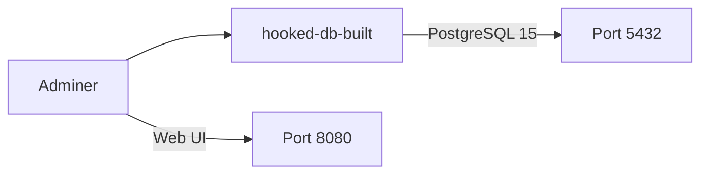
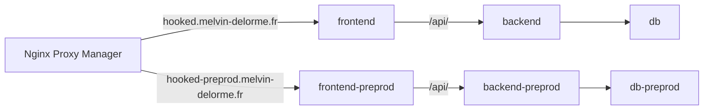
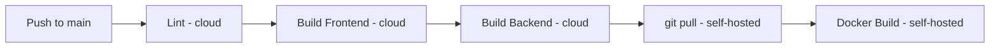

# CI/CD Pipeline

> Version: 4.0.0

---

## Architecture

```
Push to main → GitHub Actions (cloud) → Lint + Build → GitHub Actions (self-hosted) → git pull + docker compose prod up --build
Push to dev  → GitHub Actions (cloud) → Lint + Build → GitHub Actions (self-hosted) → git pull + docker compose preprod up --build
Push tag v*  → GitHub Actions → Generate release notes → Create GitHub Release
```

## Environments

| Environment | Branch | URL | Docker Compose |
|-------------|--------|-----|----------------|
| Production  | `main` | `https://hooked.melvin-delorme.fr:33443` | `docker-compose.prod.yml` |
| Preprod     | `dev`  | `https://hooked-preprod.melvin-delorme.fr:33443` | `docker-compose.preprod.yml` |

## Branch Protection

| Branch | Rules                                                          |
| ------ | -------------------------------------------------------------- |
| `main` | PR required, 1 approval, CI passing, no force push             |
| `dev`  | PR required, CI passing                                        |

## GitHub Actions Workflows

### 1. Deploy (`deploy.yml`)

**Trigger**: push on `main`

**Jobs**:
1. **lint-and-build**: Validates code compiles
   - Node 20, npm ci
   - `npm run lint` (frontend)
   - `npm run build` (frontend + backend)
2. **deploy**: Runs on self-hosted runner (production server)
   - `runs-on: self-hosted`
   - `cd /opt/hooked && git pull origin main && docker compose up -d --build`

**Self-hosted Runner**:
- Installed at `/home/pumix/actions-runner/` on production server (192.168.1.153)
- Runs as systemd service: `actions.runner.PumixA-hooked.hooked-server.service`
- User: `pumix` (member of `docker` group)
- Labels: `self-hosted`, `linux`, `x64`
- No inbound ports required (runner polls GitHub for jobs)

### 2. Deploy Preprod (`deploy-preprod.yml`)

**Trigger**: push on `dev`

**Jobs**:
1. **lint-and-build**: Same as production (validates code compiles)
2. **deploy**: Runs on self-hosted runner
   - `runs-on: self-hosted`
   - `cd /opt/hooked && git checkout dev && git pull origin dev && docker compose -f docker-compose.preprod.yml up -d --build`

### 3. Release (`release.yml`)

**Trigger**: push tag `v*`

- Generates changelog from commits since last tag
- Creates GitHub Release with auto release notes

## Docker Infrastructure

### Development (`docker-compose.yaml`)



Services:
- **hooked-db-built**: PostgreSQL database with volume persistence
- **adminer**: Database admin UI (port 8080)

### Production (`docker-compose.prod.yml`)



Services (prod):
- **frontend**: Nginx serving SPA build + reverse proxy `/api/` to backend
- **backend**: Fastify compiled (CMD: prisma migrate deploy + node dist/index.js)
- **db**: PostgreSQL 15-alpine with volume persistence
- **npm**: Nginx Proxy Manager for HTTPS/SSL termination (shared by prod + preprod)

### Preprod (`docker-compose.preprod.yml`)

Services (preprod — isolated from prod):
- **frontend-preprod**: Same image as prod, `BACKEND_HOST=backend-preprod` for nginx routing
- **backend-preprod**: Same image, separate DB connection
- **db-preprod**: Separate PostgreSQL instance with own volume (`db_data_preprod`)
- Shares the `hooked_hooked-network` Docker network with prod (for NPM access)

### Frontend Nginx Config

The frontend container uses `nginx.conf.template` (processed by `envsubst` at container start):
- Serves the SPA with `try_files $uri $uri/ /index.html` for client-side routing
- Proxies `/api/` requests to `http://${BACKEND_HOST}:3000/`
- Proxies `/uploads/` requests to `http://${BACKEND_HOST}:3000/uploads/`
- `BACKEND_HOST` defaults to `backend` (prod), set to `backend-preprod` in preprod compose

### API URL Strategy

- **Production**: Frontend uses `/api` as base URL (proxied by nginx to backend)
- **Development**: Vite dev server proxies `/api` to `http://localhost:3000`
- Configurable via `VITE_API_URL` environment variable

## Pipeline Stages



### 1. Lint
- ESLint 9 + TypeScript ESLint

### 2. Build Frontend
- `vite build` — generates `dist/` with PWA assets
- `VITE_API_URL=/api` injected at build time

### 3. Build Backend
- TypeScript compilation to `dist/`
- Prisma client generation

### 4. Self-Hosted Deploy
- Self-hosted runner on production server pulls the job
- `git pull origin main` to fetch latest code
- `docker compose up -d --build` to rebuild and restart containers

## Dev Commands

### Frontend (`hooked-pwa/frontend/`)
```bash
npm run dev       # Dev server with hot reload + API proxy
npm run build     # tsc -b && vite build
npm run lint      # ESLint check
npm run preview   # Preview production build
```

### Backend (`hooked-pwa/backend/`)
```bash
npm run dev           # nodemon + ts-node
npm run build         # tsc
npm run create-admin  # Create admin user
npx prisma migrate dev    # Run migrations
npx prisma db seed        # Seed categories
npx prisma generate       # Regenerate client
```

### Docker
```bash
docker compose up -d                                       # Start dev DB + Adminer
docker compose -f docker-compose.prod.yml up -d            # Start production
docker compose -f docker-compose.preprod.yml up -d         # Start preprod
docker compose down                                        # Stop services
docker compose logs -f                                     # View logs
```

## Versioning

- Semantic Versioning: `MAJOR.MINOR.PATCH`
- Tags on `main` branch only
- Current: v1.0.0 (first production release)
- GitHub Releases auto-generated from tags

## Repository

- **Remote**: `git@github.com:PumixA/hooked.git`
- **Deploy key**: SSH ed25519 key on server (`/home/pumix/.ssh/id_ed25519`)
- **Branches**: `main` (production), `dev` (development), `feat/*`, `fix/*`

## Server Setup (One-time)

1. Add user to docker group: `sudo usermod -aG docker pumix`
2. Clone repo in `/opt/hooked/` via SSH deploy key
3. Copy `.env` with production secrets
4. `docker compose -f docker-compose.prod.yml up -d --build`
5. Install GitHub Actions self-hosted runner:
   - Download runner to `/home/pumix/actions-runner/`
   - `./config.sh --url https://github.com/PumixA/hooked --token <TOKEN>`
   - `sudo ./svc.sh install pumix && sudo ./svc.sh start`
6. Verify runner appears as "Online" in GitHub > Settings > Actions > Runners

## Network & DNS

- **Domain**: `melvin-delorme.fr` (OVH)
- **Public IP**: `88.184.218.67` (Freebox)
- **Freebox port forwarding**: WAN `33443` → LAN `9443` (HTTPS to NPM)
- Free ISP blocks standard ports (80, 443) on residential lines → must use ports > 32768
- SSL certificates via **Let's Encrypt DNS challenge** (OVH API) since HTTP-01 challenge impossible without port 80

### Nginx Proxy Manager Routing

| Domain | Forward to | SSL |
|--------|-----------|-----|
| `hooked.melvin-delorme.fr` | `frontend:80` | Let's Encrypt |
| `hooked-preprod.melvin-delorme.fr` | `hooked-frontend-preprod-1:80` | Let's Encrypt (DNS challenge OVH) |
