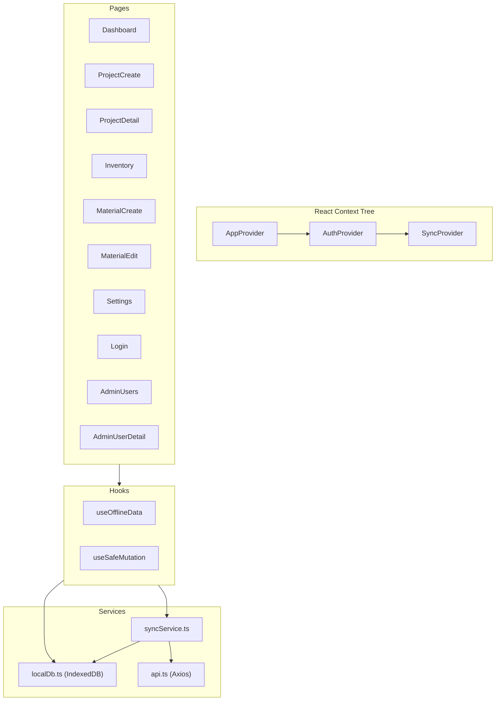
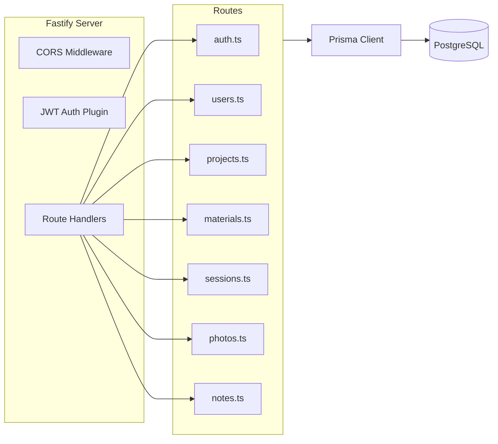
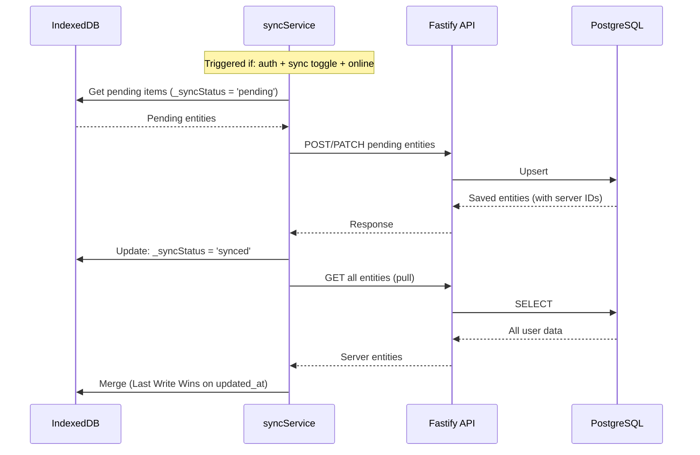
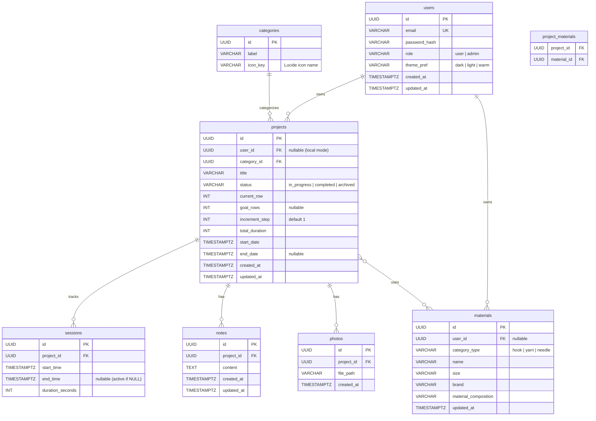

# System Architecture

> Version: 2.2.0

---

## Overview

Hooked is a PWA with an offline-first architecture. The client (React) is the primary data source via IndexedDB. The server (Fastify + PostgreSQL) serves as an optional cloud backup.

```mermaid
graph TD
    subgraph Client["Client (PWA)"]
        UI[React UI + Pages]
        Hooks[useOfflineData Hook]
        IDB[(IndexedDB)]
        SW[Service Worker / Workbox]
    end

    subgraph Server["Server (Docker)"]
        API[Fastify API]
        ORM[Prisma ORM]
        DB[(PostgreSQL)]
        Uploads[/uploads/ Photos]
    end

    UI --> Hooks
    Hooks --> IDB
    Hooks -->|if sync enabled + online| SyncService
    SyncService -->|Push/Pull| API
    API --> ORM
    ORM --> DB
    API --> Uploads
    SW -->|Cache static assets| UI
```

## Component Diagram

### Frontend Architecture



### Backend Architecture



## Data Flow

### Offline-First Read Flow

```
1. Component calls useOfflineData("projects")
2. Hook reads from localDb (IndexedDB) — ALWAYS
3. Data returned to component immediately
4. If sync enabled + online: background sync pulls latest from API
5. New data merged into IndexedDB (Last Write Wins)
6. React Query cache invalidated → UI re-renders
```

### Offline-First Write Flow

```
1. User action (e.g., increment counter)
2. useSafeMutation writes to localDb (IndexedDB)
3. Entity marked: _syncStatus = 'pending', _localUpdatedAt = now
4. UI updates immediately (optimistic)
5. If sync enabled + online:
   a. syncService pushes pending items to API
   b. Server responds with server-side IDs
   c. localDb updates: _syncStatus = 'synced', replace local-xxx IDs
```

### Sync Process (Push → Pull → Merge)



## Entity Relationships



## API Endpoints

| Method   | Path                      | Description                    | Auth     |
| -------- | ------------------------- | ------------------------------ | -------- |
| POST     | `/auth/login`             | JWT authentication             | No       |
| POST     | `/auth/register`          | Create account                 | No       |
| GET      | `/users/me`               | Current user profile           | Required |
| PATCH    | `/users/me`               | Update preferences             | Required |
| GET      | `/projects`               | List user projects             | Required |
| POST     | `/projects`               | Create project                 | Required |
| GET      | `/projects/:id`           | Get project details            | Required |
| PATCH    | `/projects/:id`           | Update project                 | Required |
| DELETE   | `/projects/:id`           | Delete project + related data  | Required |
| GET      | `/materials`              | List materials (?category_type)| Required |
| POST     | `/materials`              | Add material                   | Required |
| PATCH    | `/materials/:id`          | Update material                | Required |
| DELETE   | `/materials/:id`          | Delete material                | Required |
| POST     | `/sessions`               | Record timer session           | Required |
| GET      | `/sessions/weekly`        | Weekly total time              | Required |
| GET      | `/photos?project_id=`     | List project photos            | Required |
| POST     | `/photos?project_id=`     | Upload photo (multipart)       | Required |
| DELETE   | `/photos/:id`             | Delete photo                   | Required |
| GET      | `/notes?project_id=`      | Get project notes              | Required |
| POST     | `/notes`                  | Create/update note             | Required |
| DELETE   | `/notes/:id`              | Delete note                    | Required |
| GET      | `/categories`             | List categories                | Public   |

## Security Model

- **Authentication**: JWT tokens via `@fastify/jwt`
- **Password Storage**: bcrypt hashing
- **HTTPS**: Required for Service Workers and camera access
- **CORS**: Configured via `@fastify/cors`
- **Local Data**: IndexedDB, accessible only on the device
- **No passwords stored locally**: Only JWT token in localStorage
- **Role-based access**: `user` and `admin` roles
